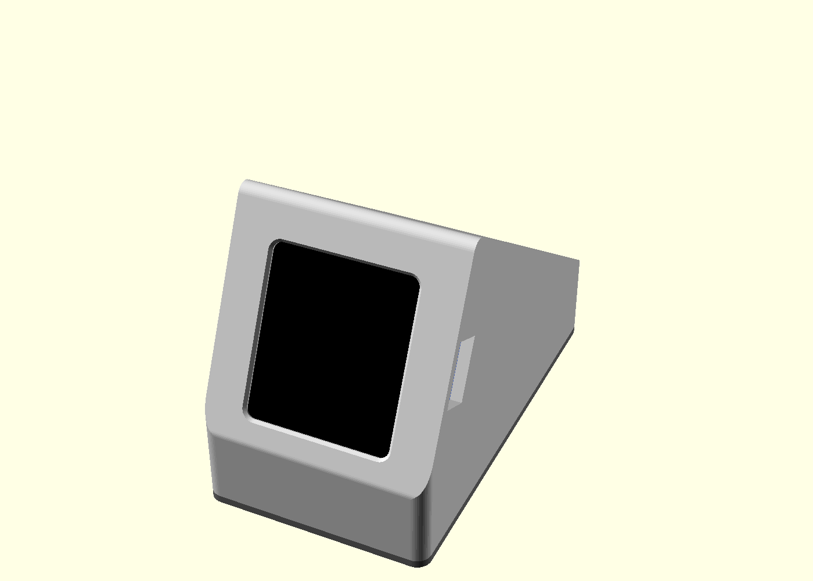
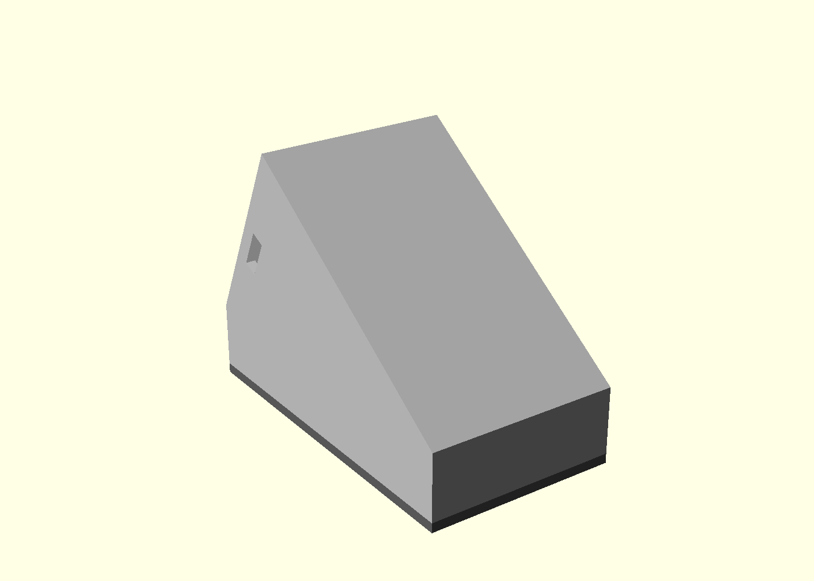
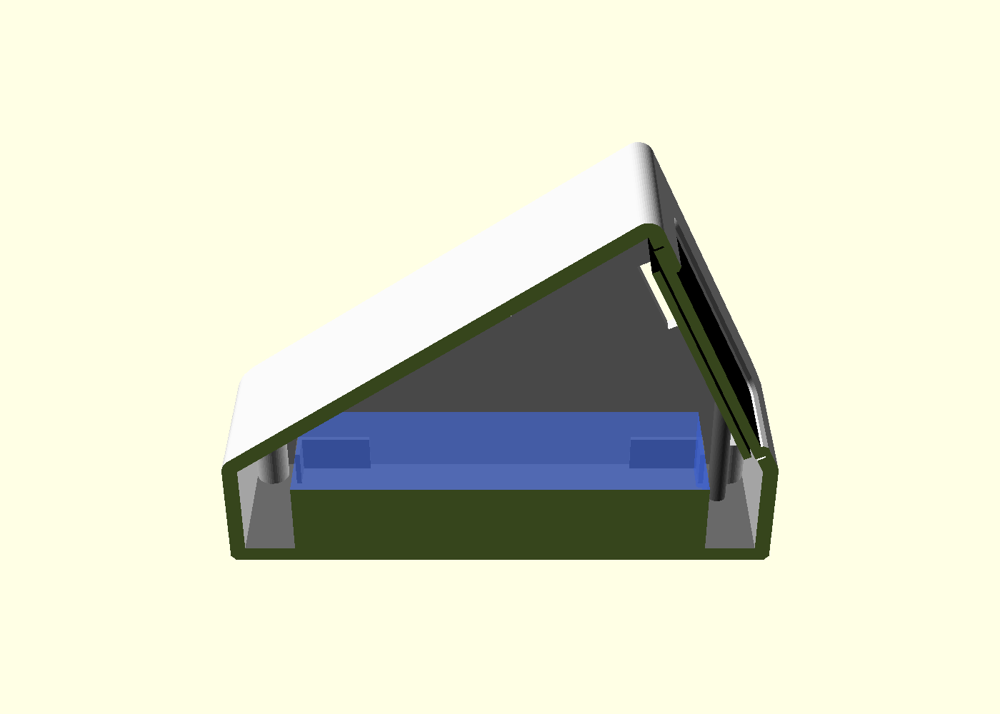
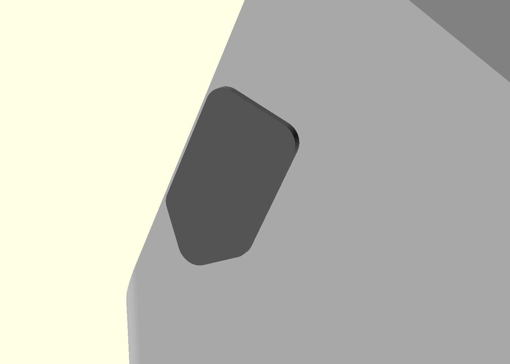

# Claude status cube: desk stands

Two printed stands, both parametric and both checked by `test.sh`. They share the board facts and fit tunables in `board.scad` (glass, PCB, openings, `clr`, `lip_t`, `board_flip`), so a measurement corrected there fixes both.

- **Wedge** (`stand.scad`, below): one closed body and a base plate.
- **Easel** (`easel.scad`, see [Easel stand](#easel-stand)): a slim bezel at 65 deg on a low tray that holds the cell; screws only, every part prints flat without supports.

The wedge is a two-part printed desk stand for the Waveshare ESP32-S3-Touch-LCD-1.69 and a 12 x 40 x 65 mm LiPo. The board sits in a glass pocket in the sloped front face (65 deg screen angle by default), the cell lies flat in a bay behind and below it, and a base plate with two pusher posts closes the bottom and presses the board into the pocket. Everything is parametric in `stand.scad`; `test.sh` checks the geometry with boolean-intersection tests.

> **Biggest unverified risk: board retention.** The board has only two lower rear contacts (the two pusher posts on the base plate); nothing supports the upper board from behind, and the pusher/retention mechanism is NOT in `fit-check.stl`, so the fit-check cannot validate retention. Touch-time rattle or flex can only be judged on the full print. Fallbacks if it rattles: foam on the pusher tips (then set `preload = -0.8`), or add a rear pad at the roof. Also check on the full print (the fit-check has no posts or rear parts) that rear parts near the lower mounting holes (for example the MX1.25 battery connector) clear the pusher posts.





Outer envelope 47.6 x 85.6 x 59.84 mm (front shell). Every dimension marked `VERIFY` in `stand.scad` is an estimate to confirm on a real print.

## Print list

1. `fit-check.stl` first (1628 triangles, print time not measured): a slice of the shell around the glass pocket with both side walls. It tests glass fit, window, Type-C relief and pinholes only, not retention. The slice has no horizontal face: print it lying on its rear cut face (the large flat face opposite the glass; use the slicer's lay-on-face, which is a rotation of `tilt` = 65 deg from the modelled orientation), so the glass face and pocket point up and no supports should be needed. Printing as modelled needs supports.
2. `stand-front.stl` (3212 triangles) and `stand-base.stl` (3124 triangles).
3. `usb-cap.stl` (320 triangles), optional: the Type-C blanking cap. See below.

Settings: 0.2 mm layers, 3 perimeters, 20% infill, PLA or PETG.

- **Front shell** prints as modelled, open bottom on the bed, with supports for the interior roof and the glass-pocket ceiling (both are required). The supports sit inside the open cavity and come out through the bottom.
- **Base plate** (`base_print()`): print with the plate's bottom face (z = -plate_t, the side with the counterbores and foot recesses) on the bed and the pushers pointing up. No supports; the `plate_cham` chamfer is a 45 deg outward overhang off the bed.

## Edges

Four cosmetic radii in `stand.scad`, each independent and each `0` for the original hard-edged wedge:

| | | |
|---|---|---|
| `edge_r` | 3.0 | the four vertical corners, in plan. The shell and the base plate share it, so the two parts stay flush around the seam. The inner cavity is rounded to `edge_r - wall` so the wall keeps its full 2.4 mm through a corner (`check_wall`). |
| `prof_r` | 2.5 | apex ridge, back top edge and the kink at the foot of the face. Costs 1.23 mm of height at the apex; the glass-pocket skin still passes `check_skin`. |
| `win_cham` | 0.6 | a 45 deg break around the window, where a finger meets the screen edge. |
| `plate_cham` | 0.8 | a 45 deg chamfer under the base plate, so nothing sharp meets the desk. |

The bottom rim of the shell is deliberately left square: it is the print surface and the mating face for the plate.

## Type-C blanking cap

`usb-cap.stl` (`part="cap"`) closes the Type-C opening when nothing is plugged in. It is modelled in its
print orientation: flange face on the bed, tongues up, no supports, about a gram of filament.

Two sprung tongues reach through the wall and snap behind its inner face; the flange covers the opening
from the outside and carries a lift ear, so a fingernail pops it out. It follows `board_flip` like every
other opening, so it fits whichever wall the port ends up on.



| | | |
|---|---|---|
| `cap_clr` | 0.15 | clearance into the opening, per side |
| `cap_barb` | 0.45 | snap ridge, per side; `cap_barb - cap_clr` = 0.3 mm of it engages behind the wall |
| `cap_wall` | 0.8 | tongue thickness: this is what flexes, so thinner is softer |
| `cap_flange` | 1.6 | how far the flange stands past the opening, per side |
| `cap_lip` | 0.9 | flange thickness: how far it stands proud of the wall |
| `cap_ear` | 2.2 | radius of the lift ear |
| `cap_land` | 1.0 | how far the tongues reach past the inner wall face |

The fit is **unverified on a print**, and it inherits every `VERIFY` in the Type-C relief: the cap is sized
from `usb_plug_w` x `usb_plug_h`, so if you change those after measuring your plug, the cap follows. Print
it with the fit-check coupon and try it in that first: too tight to start, raise `cap_clr`; falls out,
raise `cap_barb` or lower `cap_clr`; too stiff to push in, lower `cap_wall`.

The geometry tests check that the tongues pass through the opening with clearance, that the barbs really
do reach past the inner wall face, that the flange covers the opening and seats on flat wall, and that
nothing touches the board, each with a control that must fail.

## Hardware

- 4 x M2 x 6 self-tapping screws (an M2 x 8 bottoms out at the pilot) (or heat-set inserts with `insert_mode = true`)
- 4 rubber feet, 8 mm
- optional 1 mm foam tape on the pusher tips (then set `preload = -0.8`)

## Assembly order

1. Connect the battery to the board before closing (see the polarity warning).
2. Set the board into the glass pocket from behind, glass first.
3. Screw on the base plate; the pushers press the board's lower edge into the pocket.
4. Stick on the feet.

## Fit-check procedure

Print `fit-check.stl` and check:

- the glass drops in without force: if tight or loose, adjust `clr` (and `glass_a`, `glass_b`, `glass_r`);
- the window leaves the touch area clear: `act_a0`, `act_b0`, `win_margin`;
- the Type-C plug seats: the slot (`usb_a`, `usb_w`, `usb_h`) is surrounded by a plug relief (`usb_plug_w` x `usb_plug_h` = 13 x 7.5 mm, VERIFY) cut through the wall starting `usb_plug_x0` = 3 mm beyond the PCB edge, so the overmold can reach within a few mm of the board edge (the PCB edge is about 8.9 mm from the outer wall, the wall is 2.4 mm thick). Measure your plug and adjust `usb_plug_w`, `usb_plug_h`, `usb_plug_x0`;
- a paper clip reaches RST / BOOT / PWR through the pinholes: `btn_a`, `btn_y`, `pin_d`;
- the tallest rear part clears: `board_t`.

The opening positions (Type-C slot, buttons) and many board dimensions are `VERIFY` items: measure them on the fit-check print, edit the values, and re-run `./test.sh stand` after every edit. Also check the battery position against the board's chip antenna (see Antenna).

## Orientation

The orientation is inferred, not measured: Type-C and the battery connector are on the right wall, RST / BOOT / PWR on the left wall. If the board turns out the other way round, or the screen is upside down, set `board_flip = true` in `stand.scad`. That rotates the board 180 deg, and swaps the openings to the opposite walls. No firmware change is needed: the cube reads its IMU and turns the picture the right way up on its own. With `board_flip = true` the pusher posts sit further back, so the front end zone grows automatically to keep them at least 1 mm (`push_gap`) in front of the battery bay; the stand gets slightly deeper (about 86.56 mm instead of 85.6 at tilt 65); a lower tilt also grows it (about 86.3 mm at tilt 55, no flip). Re-export the STLs after changing it.

## Battery polarity warning

MX1.25 connector pinouts vary by vendor. Compare the battery lead against the `+` / `-` marks on the board before connecting; a swapped pair can destroy the board or the cell. The battery pocket is 65.8 x 40.8 x 12.8 mm and the LiPo must not be compressed: do not force a thicker cell in, and do not let the lid or the base squeeze it.

## Antenna

The battery and its metal pouch must not sit over the board's chip antenna. The model does not include the antenna, so the bay position relative to it is **unverified**: before closing the stand, locate the chip antenna on the board and confirm physically that the battery does not sit over it. The body is plastic only.

## Tests and regenerating

`./test.sh` (both stands; `./test.sh stand` or `./test.sh easel` for one; uses Docker via `tools/openscad`, override with `OPENSCAD=...`) must exit 0. Export:

```sh
tools/openscad --backend=manifold -D 'part="front"' -o stand-front.stl stand.scad   # also part="base", part="fit", part="cap"
python3 tools/stlcheck.py stand-front.stl
```

Previews were rendered headless with `--render` and `xvfb-run` (installed with apt inside the Docker image; not scripted here), using `part="assembly"` / `part="section"` / `part="cap_fitted"` with a section camera rotated 270 deg about z. They are illustrative and not reproducible from this repo alone.

## Easel stand

`easel.scad`. The board stands at 65 deg (`tilt`) in a slim bezel, held from behind by a carrier that stands on the lid of a low tray; the 12 x 40 x 65 mm cell lies flat in the tray, mostly behind the screen. Assembled envelope 46 x 81 x 67.8 mm. Same constraints as the wedge: the whole active area open, Type-C reachable (plug relief plus an optional cap), RST / BOOT / PWR through pinholes, plastic only near the antenna, no supports.

### Print list

| File | Part | Print orientation |
|---|---|---|
| `easel-tray.stl` | tray, 46 x 81 x 15.2, battery bay, screw pilasters, Ø8 foot recesses | open side up |
| `easel-frame.stl` | 2.4 mm lid with a lightened centre fin that backs the carrier | lid down |
| `easel-carrier.stl` | back plate, four posts (shoulders press the PCB, pegs locate it in its holes), two legs with hinge ridges | rear face down |
| `easel-bezel.stl` | glass pocket and window, open chin with hinge grooves, Type-C relief, pinholes | front face down |
| `easel-usb-cap.stl` | optional Type-C blanking cap (crush ribs) | flange down |

**Print the carrier first** and press the real board onto its pegs before printing the rest: the PCB hole positions are assumed (see VERIFY below). If the pegs miss, set `peg_l = 0`; the shoulders still press the PCB.

### Hardware

Self-tapping M2 into Ø1.8 pilots, no glue: 2 x M2 x 10 (legs), 1 x M2 x 8 (rear of the lid), 2 x M2 x 6 (top of the bezel, from the carrier's rear). 4 x Ø8 rubber feet.

### Assembly order

1. Cell into the tray, tab end forwards; thread the lead up through the lid slot on the board's connector side.
2. Frame on; fit the rear M2 x 8.
3. Carrier on the lid; two M2 x 10 down through the legs clamp carrier, lid and tray in one go. These go in **before the board**: once the board and bezel are on, the leg screws are covered.
4. Plug the lead into the board, then press the board onto the pegs, glass outwards.
5. Hold the bezel tilted forward with its front-bottom edge on the lid and swing it back over the glass: the grooves in its chin pick up the ridges on the legs.
6. Two M2 x 6 from the carrier's rear into the bezel.

To get at the board or the lead later, take out the two top screws and swing the bezel off.

### Hinge

Ridges and grooves are arc bands concentric with the bezel's front-bottom edge (the hinge line), so swinging the bezel about that edge slides each groove along its ridge and nothing else meets. Closed, the ridges stop the chin lifting or sliding forward and the grooves locate it sideways. The lower corners of the glass pocket are square behind the glass on purpose: round ones sweep into the glass and PCB corners during the swing. The tests swing it 5, 10, 20 and 30 deg with the board nominal and sagged 0.2 mm on its pegs. Clearances are 0.2 mm in printed plastic; if it binds, sand the ridges.

### Stability

`tools/stability.py` estimates mass, centre of gravity and the push into the screen that tips the stand backwards, from the parts in place (PLA at 1.24 g/cm³ x 0.9 solidity, 55 g cell, 12 g board, pivot 1 mm inside the rear feet). Nominal: 109.5 g; 3.2 N at the centre of the active area, 1.45 N at its top edge (`test.sh` requires 3.0 and 1.3). Estimates, not measurements.

### VERIFY (easel-specific, on top of the board items in `board.scad`)

- PCB mounting-hole positions (the pegs); assumed symmetric.
- Where the MX1.25 battery connector sits on the board's rear, and the lead's route beside a leg to it.
- Which end of the cell the tabs leave from (assumed: the front).

`board_flip` works here too and needs no firmware change. Export:

```sh
tools/openscad --backend=manifold -D 'part="carrier"' -o easel-carrier.stl easel.scad   # also tray, frame, bezel, cap (-> easel-usb-cap.stl)
python3 tools/stability.py build/easel   # after ./test.sh easel has rendered the at_* parts
```

There are no easel preview images (no headless PNG export here); `part="assembly"` and `part="section"` render the parts in place for viewing in OpenSCAD.
